# Amazon Bin Image Dataset(ABID) Challenge

The Amazon Bin Image Dataset contains images and metadata from bins of a pod in an operating Amazon Fulfillment Center. The bin images in this dataset are captured as robot units carry pods as part of normal Amazon Fulfillment Center operations. You can download and find the details at [here](https://aws.amazon.com/ko/public-datasets/amazon-bin-images/).  We propose 3 different tasks, which would be practically useful when we want to double-check the bins before they are packed or delivered. Tasks are sometimes very challenging because of heavy occlusions and a large number of object categories. We would like to open a new challenge in order to attract talented researchers in both academia and industries for these tasks. As a starting point, we provide baseline methods and pre-trained models for two tasks, counting and object verification tasks.

#### News!! we are currently under updating process(updating train/val splits and new test sets). We hope it will be finalized in few weeks! But you can stil play with the dataset and tasks.

## 1. Tasks

### 1.1. Counting
This is a simple task that you are supposed to count every object instances in the bin. You count individual instances separately, which means if there are two same objects in the bin, you count them as two. 
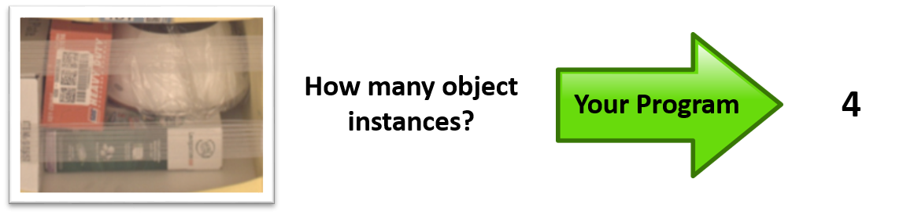

### 1.2. Object verification 
This is a task for verifying the presence of the object in the bin. You will be given an image and question pair. The question contains object category and it's presence, e.g. 'Is there a toothbrush in the bin?'. Your program should be able to give an answer 'yes' or 'no'.
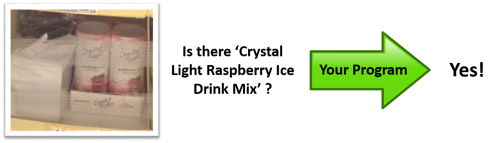

### 1.3. Object quantity verification 
This is a task for verifying the quantity of the object in the bin. You will be given an image and question pair. The question contains the quantity of the object, e.g. 'are there 2 toothbrush in the bin?', your program should be able to give an answer 'yes' or 'no'. In this task, the image in question contains at least one object in question.

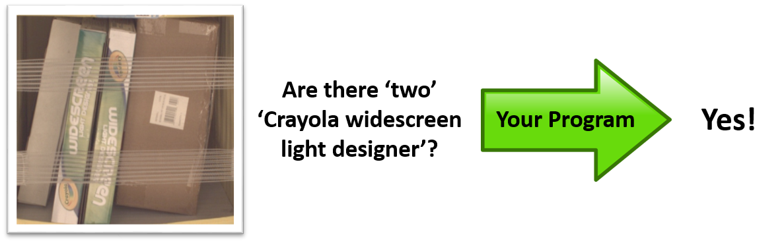


### Evaluation metrics
For counting task, you will be evaluated by two standrad metrics, accuracy(precision) and root mean square error(RMSE). 1 is indicator function, and p and g is prediction and ground truth respectively.


For both verification tasks, you will be evaluated by accuracy.

## 2. Dataset

These are some typical images in the dataset. A bin contains multiple object categories and various number of instances. The corresponding metadata exist for each bin image and it includes the object category identification(Amazon Standard Identification Number, ASIN), quantity, size of objects, weights, and so on. The size of bins are various depending on the size of objects in it. The tapes in front of the bins are for preventing the items from falling out of the bins and sometimes it might make the objects unclear. Objects are sometimes heavily occluded by other objects or limited viewpoint of the images.

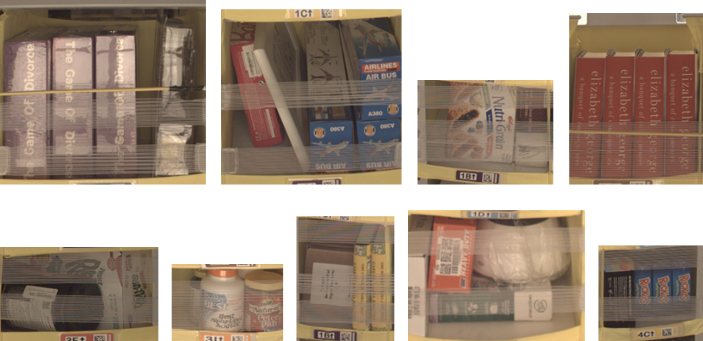

### 2.1 Metadata

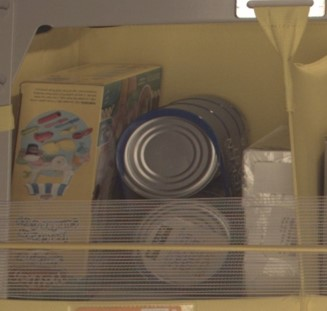

```
{
    "BIN_FCSKU_DATA": {
        "B00CFQWRPS": {
            "asin": "B00CFQWRPS",
            "height": {
                "unit": "IN",
                "value": 2.399999997552
            },
            "length": {
                "unit": "IN",
                "value": 8.199999991636
            },
            "name": "Fleet Saline Enema, 7.8 Ounce (Pack of 3)",
            "normalizedName": "(Pack of 3) Fleet Saline Enema, 7.8 Ounce",
            "quantity": 1,
            "weight": {
                "unit": "pounds",
                "value": 1.8999999999999997
            },
            "width": {
                "unit": "IN",
                "value": 7.199999992656
            }
        },
        "ZZXI0WUSIB": {
            "asin": "B00T0BUKW8",
            "height": {
                "unit": "IN",
                "value": 3.99999999592
            },
            "length": {
                "unit": "IN",
                "value": 7.899999991942001
            },
            "name": "Kirkland Signature Premium Chunk Chicken Breast Packed in Water, 12.5 Ounce, 6 Count",
            "normalizedName": "Kirkland Signature Premium Chunk Chicken Breast Packed in Water, 12.5 Ounce, 6 Count",
            "quantity": 1,
            "weight": {
                "unit": "pounds",
                "value": 5.7
            },
            "width": {
                "unit": "IN",
                "value": 6.49999999337
            }
        },
        "ZZXVVS669V": {
            "asin": "B00C3WXJHY",
            "height": {
                "unit": "IN",
                "value": 4.330708657
            },
            "length": {
                "unit": "IN",
                "value": 11.1417322721
            },
            "name": "Play-Doh Sweet Shoppe Ice Cream Sundae Cart Playset",
            "normalizedName": "Play-Doh Sweet Shoppe Ice Cream Sundae Cart Playset",
            "quantity": 1,
            "weight": {
                "unit": "pounds",
                "value": 1.4109440759087915
            },
            "width": {
                "unit": "IN",
                "value": 9.448818888
            }
        }
    },
    "EXPECTED_QUANTITY": 3
}
```

This is an example of image(jpg) and metadata(json) pair. This image contains 3 different object categories. For each category, there is one instance. So, "EXPECTED_QUANTITY" is 3, and for each object category "quantity" field was 1. Unique identifier("asin") is assigned to each object category, e.g. here "B00CFQWRPS", "B00T0BUKW8", and "B00C3WXJHY". 

### 2.2 Dataset statistics
| Description | Total | Train | Validation | 
|----------------------|---------|---------|--------|
| The number of images | 535,234 | 481,711| 53,523 |
| Average quantity in a bin | 5.1 | 5.11 | 5.08 |
| The number of object categories | 459,476 | 441,485 | 105,003 |

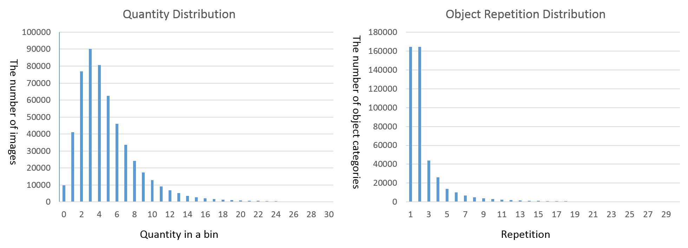

The left figure shows the distribution of quantity in a bin(90% of bin images contains less then 10 object instances in a bin). The right figure shows the distribution of object repetition. 164,255 object categories (out of 459,475) showed up only once across entire dataset, and 164,356 object categories showed up twice. The number of object categories that showed up 10 times was 3038.

## Prerequisites
1. [PyTorch](https://github.com/pytorch/pytorch)
2. [torch-vision](https://github.com/pytorch/vision)
3. This code is heavily based on pytorch [example codes](https://github.com/pytorch/examples)

## 3. Data preparation
[dataset](dataset) directory includes useful codes for dataset preparation and development kits.

### 3.1 Downloading data
You need to download the dataset first and locate images and metadata in same directory, e.g. $(data)/bin-images, $(data)/metadata. Soft link to them in dataset directory. For downloading, find more details at [here](https://aws.amazon.com/ko/public-datasets/amazon-bin-images/)
```
$(abid_challenge_root)/dataset> ln -s $(data) ./data
```

### 3.2 Training and validation split
You can make your own training/validation split. For example, we provide code to randomly split, which will generate 'random_train.txt' and 'random_val.txt' files.
```
$(abid_challenge_root)/dataset> python random_split.py
```

We also provide train/val splits that we used to train our baseline methods and you can download it by running
```
$(abid_challenge_root)/dataset> ./get_random_split.sh
```

Next, we will make metadata.
```
$(abid_challenge_root)/dataset> python make_metadata.py
```
You will see 'metadata.json'(~640M) and 'instances.json'(76M) files. 'metadata.json' file contains all metadata in a single file, and 'instances.json' file contains a list of all object categories and image indices that contain the object. They will be useful for investigating metadata of the datasets and used to generate task specific metadata files. For your convinience, we also provide pre-computed files, and you can download it by
```
$(abid_challenge_root)/dataset> ./get_metadata.sh
```

### 3.3 Task specific metadata
Once you have train/val split and metadata files, now you can generate task specific metadata files. This will be used when you train the baseline methods.
```
$(abid_challenge_root)/dataset> python make_counting_data.py
$(abid_challenge_root)/dataset> python make_obj_verification_data.py
```
This will generate 'counting_train.json', 'counting_val.json', 'obj_verification_train.json', 'obj_verification_val.json' files. Alternatively, You can simply download pre-processed task specific metadata for training and validataion sets, which we used for making the baseline methods.
```
$(abid_challenge_root)/dataset> ./get_task_data.sh
```

### 3.4 Resizing images
For baseline methods, we resized all image into 224x224 for convinient training purpose. You will have new directory $(data)/bin-images-resize that contain resized images
```
$(abid_challenge_root)/dataset> python resize_image.py
```

### 3.5 Moderate and hard task
We divide the each task into two levels of difficulty(moderate and hard). For moderate difficulty, you will be tested over the bin images that contain upto 5 objects. For hard task, you will be tested over all bin images. You can submit your results whatever you are interseted (both, or one of them). As baseline methods, we provide ones for moderate difficulty.

## 4. Deep Convolutional Classification Network for Counting
It is a simple classification network for counting task. The deep CNN will classify the image as one of 6 categories(0-5, for moderate difficulty). We used resnet 34 layer architecture and trained from the scratch. 

### 4.1 Metadata format
Both 'counting_train.json' and 'counting_val.json' are list of [image idx, count] pairs.
```
# The first few examples of 'counting_train.json'
[[4, 4], [5, 5], [6, 4], [8, 1], [9, 4], [12, 0], [13, 1], ......
```

### 4.2 Training
```
$(abid_challenge_root)/counting> mkdir snapshots
$(abid_challenge_root)/counting> CUDA_VISIBLE_DEVICES=0 python train.py $(data)/bin-images-resize/ -a resnet34 --epochs 40 --lrd 10
```
It will run 40 epochs, and every 10 epochs learning rate will decay by a factor of 0.1. One epoch means the network goes through all training images once. Batch size is 128. Following shows loss curves and validation accuracy. Here we got best validation accuracy at 21 epoch. As you might notice, it will start to overfit after 21 epoch.

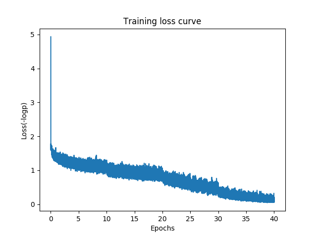
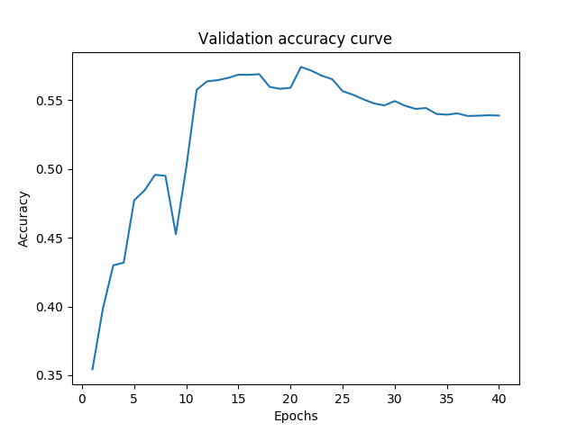

#### 4.2.1 Pretrain models
You can download pre-trained models [here](http://www.cs.unc.edu/~eunbyung/abidc/resnet34_best.pth.tar)

### 4.3 Evaluation on validataion sets
```
$(abid_challenge_root)/counting> CUDA_VISIBLE_DEVICES=0 python train.py $(data)/bin-images-resize/ -a resnet34 --evaluate True --resume ./snapshots/resnet34_best.pth.tar
```
You should be able to get 55.67% accuracy. You also get output file 'counting_result.txt', which is going to be your submission file format. Each line contains a integer value(count) corresponding to one image being evaluated. You will be evaluated by two metrics, accuracy and RMSE(Root Mean Square Error). Following shows the results on validation split(you can also get same outputs with evaluate.py script)

| Accuracy(%) | RMSE(Root Mean Square Error)|
|----------------------|--------|
| 55.67 | 0.930 |

| Quantity | Per class accuracy(%) | Per class RMSE |
|-------|--------------------|----------------|
| 0 | 97.7 | 0.187 |
| 1 | 83.4 | 0.542 |
| 2 | 67.2 | 0.710 |
| 3 | 54.9 | 0.867 |
| 4 | 42.6 | 1.025 |
| 5 | 44.9 | 1.311 |

## 5. Deep Convolutional Siamese Network for Object Verification
We provide one baseline method for object verification task. Since the number of object categories are huge, we propose to learn how to compare the images instead of modelling all individual object categories. For example, we pick positive pair, which both images should contain at least one common object(no common object for negative pair), and train the network to classify the pair as positive or negative. Siamese network would be proper architectural choice for this purpose.

This is based on following paper, Siamese neural networks for one-shot image recognition, Gregory Koch, Richard Zemel, Ruslan Salakhutdinov, ICML Deep Learning Workshop, 2015, [pdf](http://www.cs.cmu.edu/~rsalakhu/papers/oneshot1.pdf). 

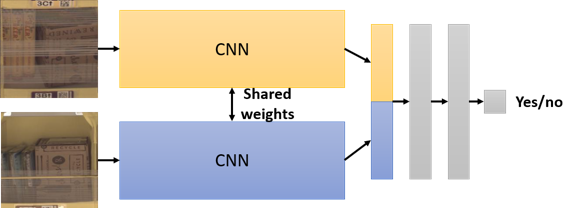

When testing, we are given one image and the name of object category(asin) in question. From training images, we pick all images that contain the object category in question, and make pairs with the given image. And, we will make final decision as a majority votes based on the results from all pairs. More formally,


,where S is the set of {x1,x2} image pair, one is test image and one from training images that contains the object category in question. 1[ ] is an indicator function and p is estimated probability of being positive by siamese network.


### 5.1 Metadata format
Following is an example entry in 'obj_verification_train.json' file.
```
#'obj_verification_train.json'
......
[17, [[u'B006SA39OU', [502755, 502756]], 
[u'B00KVP76G0',[11868, 88067, 101420, 128533, 137335, 153851, 168758, 
168759, 193135, 196252, 213359, 215756, 215779, 223046, 363267, 395590, 
408633, 475994, 508732, 509286, 513613]]]], 
......
```
Each elements of the list contain the image index(here, 17), and object list that showed up in the image. This image contain two objects, whose asins are 'B006SA39OU' and 'B00KVP76G0'. For each objects, we included the other image indices that contain this objects. In other words, you can find 'B006SA39OU' objects in two other images in training sets, here 502755 and 502756. Note that this is for the purpose of training siamese network. If your algorithm require different data formats, you can make your own metadata.

Followings are the example entries in 'obj_verification_val.json' file.
```
#'obj_verification_val.json'
......
[359589, u'0323185940', 1, [24846, 359588, 374440]],
[120755, u'B004PK1JYM', 0, [99518]],
[154127, u'B01ESD07YI', 1, [154128]],
......
```
Each entries contains image index, object asin in question, positive or negative(1 or 0). If the question is positive, the object in question is in the image. If not, the object in question is not in the image in the question. We additionally put the image indices of training sets that contain the object in question.

### 5.2 Training
```
$(abid_challenge_root)/verification_siamese> mkdir snapshots
$(abid_challenge_root)/verification_siamese> CUDA_VISIBLE_DEVICES=0 python train.py $(data)/bin-images-resize/ -a resnet34 -b 128 --epochs 40
```
It will run 40 epochs, and every 10 epochs learning rate will decay by a factor of 0.1. 1 epoch means the network goes through all training images once. Resnet34 architecture will be used and it will be trained from the scratch and batch size is 128. Following shows loss curves and validation accuracy. Here we got best validation accuracy at 36 epoch.

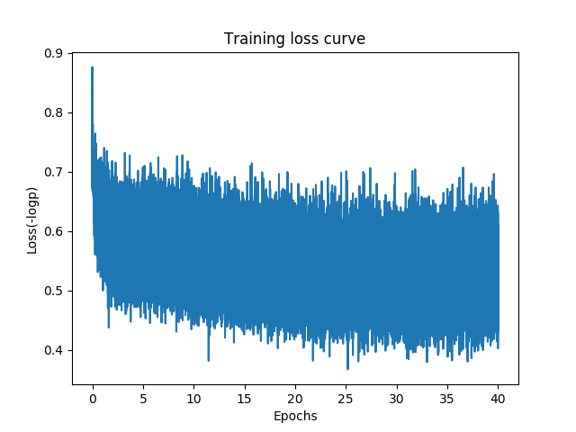
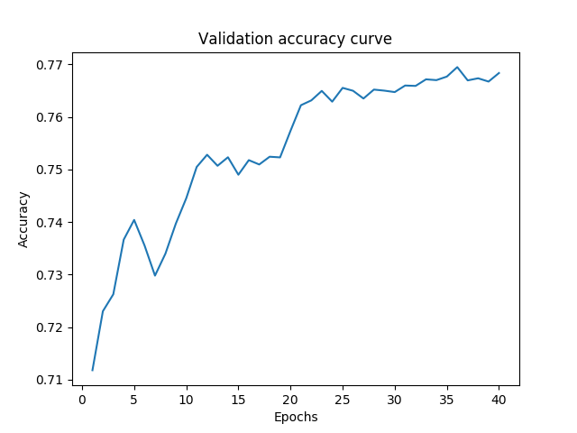

#### 5.2.1 Pretrain models
You can download pre-trained models [here](http://www.cs.unc.edu/~eunbyung/abidc/resnet34_siamese_best.pth.tar)

### 5.3 Evaluation on validataion sets
```
$(abid_challenge_root)/verification_siamese> CUDA_VISIBLE_DEVICES=0 python train.py $(data)/bin-images-resize/ -a resnet34 --evaluate True --resume ./snapshots/resnet34_siamese_best.pth.tar
```
You should be able to get 76.3% accuracy. You also get output file 'obj_verification_result.txt', which is going to be your submission file format. Each line contains a binary value(0 or 1) corresponding to one pair(image and question). You will be evaluated by accuracy metric.

Followings are a few of examples. You are given a question, e.g. Is there an Prebles' Artforms(11th Edition) in the bin? and an image in question(left image). The right image is picked from training image that the contains the object in question. Pred is prediction of the network and GT is ground truth. We also put estimated probability in the bracket. If GT is 'yes', then both images should have the object in question. If GT is 'no', then both images should not have the object in question.

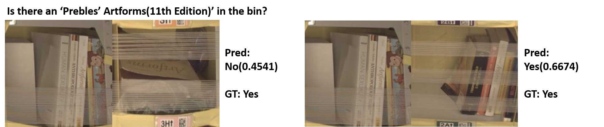

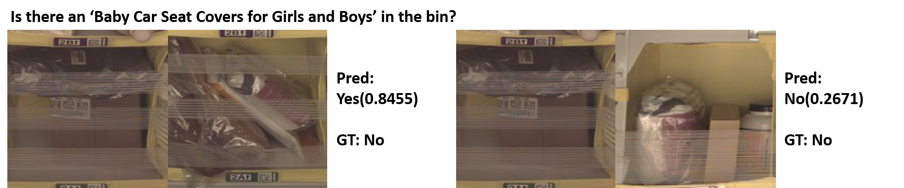


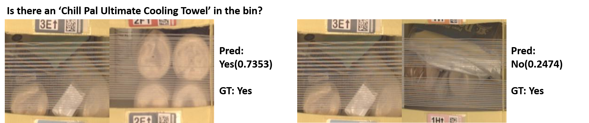

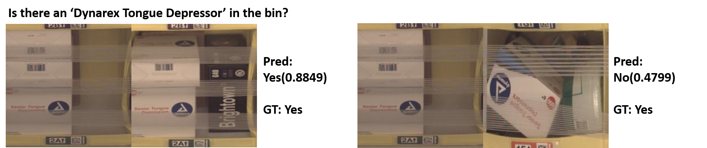


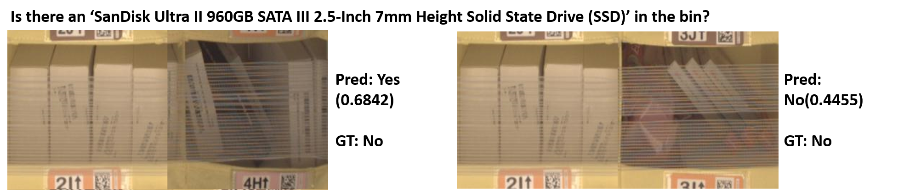

## 6. Object quantity verification
We don't provide any baseline methods. We leave it to your creativity!

### 6.1 Metadata format
We don't provide metadata for training purpose(it's up to you!). But we provide metadata for validataion puspose. File format is similar to the one from object verification task.
```
#'obj_num_verification_val.json'
......
[74, u'B0007L1VLO', 0, 2, 1, [157536, 163965, 183365, 261988, 281099, 367408, 367409]],
[108, u'B01EIF6UVA', 1, 1, 1, [109]],
[108, u'B01BYKIYUW', 1, 2, 2, [109, 5349, 5350]],

......
```
Each entries contains image index, object asin in question, positive or negative(1 or 0), ground truth quantity, quantity in question.  If the question is positive, ground truth quantity and quantity in question must be same. If not, the quantity in question was randomly selected. We also put the image indices of training sets that contain the object in question for you convinience.

## 7. Contacts
For general challenge questions, please use ilsvrc@image-net.org. For specific amazon bin dataset questions, please send to eunbyung@cs.unc.edu.
